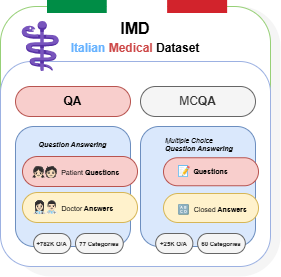
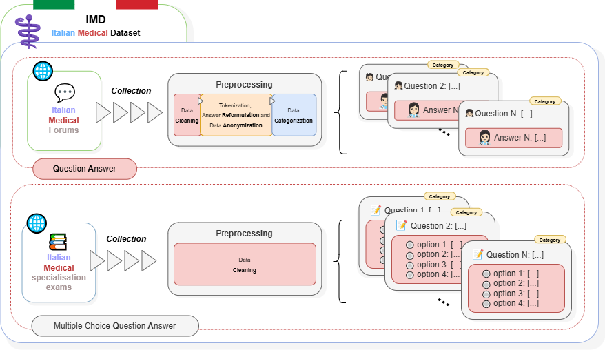

# ⚕️ IMD (Italian Medical Dataset) 🇮🇹

    

**IMD (Italian Medical Dataset)** is a cutting-edge resource for **Natural Language Processing (NLP)** in the medical domain, specifically designed to improve the accuracy and reliability of **Question Answering (QA)** models in the **Italian language**. The dataset is split into two primary components:

- **IMD-QA**: Questions and answers extracted from Italian medical forums, reflecting informal language used by patients and healthcare professionals.
- **IMD-MCQA**: Multiple-choice questions from Italian medical specialization exams, ideal for training models focused on structured and formal medical queries.

## ⚙️ How to Use the Dataset  

To use the dataset, you can access it via **Google Drive** and download the required files or [**Download Now**](https://github.com/picuslab/IMD/releases/download/IMD-v1.0/IMD-v1.0.zip) from GitHub. The dataset is provided in **JSON format**, structured to facilitate integration with **Natural Language Processing (NLP) models**, including those designed for **Question Answering (QA)** and **Multiple-Choice QA (MCQA)** tasks.  

📂 **Dataset Access:**  
- **IMD-QA** (Italian Medical QA Dataset): [🔗 Google Drive Link](https://drive.google.com/file/d/1G2k6Ir6v3RaufADYG_k1K08HakUcwNnJ/view?usp=sharing)  
- **IMD-MCQA** (Italian Medical MCQA Dataset): [🔗 Google Drive Link](https://drive.google.com/file/d/1OExALbS4HrFLt02_nI4L8lLW07Q9U9gT/view?usp=sharing)  

## 🗃️ Structure
The composition of IMD is:   

## 📊 Dataset Statistics

| Statistic                        | IMD-QA                  | IMD-MCQA              |
|-----------------------------------|-------------------------|-----------------------|
| **# Questions and Answers**       | 782,644                 | 25,862                |
| **# Categories**                  | 77                      | 60                    |
| **Last Update**                   | July 2024               | July 2024             |
| **Total Answer Tokens**           | 40,370,381              | 9,321                 |
| **Unique Answer Vocabulary**      | 154,837                 | 1,234                 |
| **Total Question Tokens**         | 137,129,435             | 282,239               |
| **Unique Question Vocabulary**    | 1,397,929               | 19,214                |
| **Unique Total Vocabulary**       | 1,552,766               | 20,448                |

## 🧹 Preprocessing
**Workflow for constructing** the Italian Medical Dataset (IMD), divided into two main components: IMD-QA and IMD-MCQA. **IMD-QA** collects data from Italian medical forums, processing them through cleaning, tokenization, anonymization, and categorization to create a structured dataset of questions and answers. **IMD-MCQA**, on the other hand, integrates data from medical specialization exam simulations, applying a collection and cleaning process to generate a dataset of multiple-choice questions.   

### IMD-QA 🧑‍⚕️

- **Data Cleaning**: Removal of incomplete or truncated questions, metadata (doctor signatures, timestamps), and textual inconsistencies while preserving the original medical intent.
- **Text Normalization & Answer Reformulation**: Answers were reformulated using **Llama3-Med42-8B**, a Large Language Model (LLM) fine-tuned for medical applications. The focus was on:
  - Eliminating redundancy and colloquial language.
  - Ensuring stylistic consistency across responses.
  - Enhancing readability and grammatical accuracy.
- **Anonymization**: The model identified and removed personally identifiable information (PII) such as patient names, doctor names, healthcare facilities, etc.

### IMD-MCQA 📝

- **Data Organization**: The dataset's multiple-choice questions were already structured, so the preprocessing mainly focused on standardizing the data format and ensuring consistency across entries.

## 🏷️ Data Categorization

The **IMD-QA** dataset was organized into major categories using **unsupervised topic modeling**. Techniques like **BERTopic**, **UMAP**, and **HDBSCAN** were used to group semantically similar questions into macro-categories. This approach enables flexible and interpretable categorization without rigid constraints.

### General Categories and Question Distribution

| **Category**                                           | **# Questions** |
|--------------------------------------------------------|-----------------|
| Urology, Andrology, and Male Health                    | 110,052         |
| Gastroenterology and Digestive Health                  | 104,449         |
| Mental Health                                          | 103,893         |
| General Medicine and General Surgery                   | 87,789          |
| Ophthalmology, Otorhinolaryngology, Dentistry, and Pneumology | 83,710       |
| Cardiology, Circulatory System, and Hematology         | 81,232          |
| Gynecology and Female Health                           | 65,792          |
| Orthopedics and Musculoskeletal System                 | 50,283          |
| Dermatology, Allergies, and Aesthetics                 | 49,288          |
| Neurology                                              | 46,704          |

## 🤝 Contributing

We welcome contributions to improve the dataset! To contribute, simply open a pull request or report issues on our [issue tracker](https://github.com/picuslab/IMD/issues). We look forward to your improvements!

### 🌐 Notes

- **Data Cleaning & Anonymization**: Preprocessing steps have been applied to ensure privacy and data integrity while keeping the content relevant for medical applications.
- **Dataset Usage**: The dataset is intended for academic and research purposes only. It is not recommended for clinical decision-making or commercial use.

👨‍💻 This project was developed by Antonio Romano, Giuseppe Riccio, Marco Postiglione, and Vincenzo Moscato at *University of Naples, Federico II*

## 📜 License

This work is licensed under a
[Creative Commons Attribution-NonCommercial-NoDerivs 4.0 International License][cc-by-nc-nd].

[![CC BY-NC-ND 4.0][cc-by-nc-nd-image]][cc-by-nc-nd]

[cc-by-nc-nd]: http://creativecommons.org/licenses/by-nc-nd/4.0/
[cc-by-nc-nd-image]: https://licensebuttons.net/l/by-nc-nd/4.0/88x31.png
[cc-by-nc-nd-shield]: https://img.shields.io/badge/License-CC%20BY--NC--ND%204.0-lightgrey.svg
